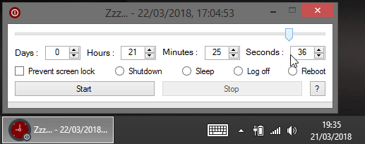

# Zzz...

## About
Windows tool to automatically shut down, reboot, log off, hibernate or keep awake a computer during/at a specified time.

## Features

- At a specified time:
  - Sleep computer
  - Hibernate computer
  - Reboot computer
  - Shut down computer
  - Log off user
- With following options:
  - Prevent screen lock
  - Turn off screen(s)
  - Lock session
- Can be minimized / controlled from systray
- Fully portable, no rights / setup needed
- No administrator rights needed
- Free, copyleft license

## Requirements
- Microsoft [.NET Framework 4](https://www.microsoft.com/en-US/download/details.aspx?id=17851)
- Microsoft Windows Vista or later

## Todo
- Localization
- Custom commands
- Keep user settings
- Final countdown before action
- Merge with [CashSavingExceeded](https://github.com/FoxP/CashSavingExceeded) (?)
- Low CPU / bandwidth / user activity detection
  
## License
Zzz... is released under the [GNU General Public License v3.0](https://www.gnu.org/licenses/gpl-3.0.fr.html).
